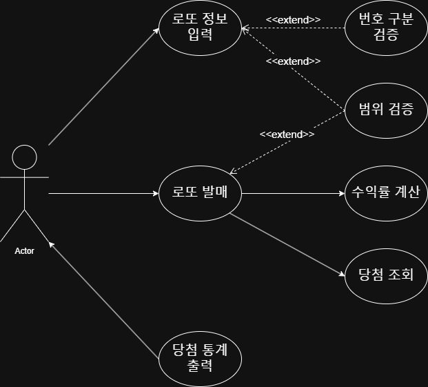

# 프리코스 3주차 - 로또
## 1. 프로젝트 개요
> 로또를 뽑고 몇 개가 당첨됐는지, 수익률은 얼마인지 출력
## 2. 기능 목록
### 1. 로또 구매 금액 입력
- [ ] 1000원 단위인지 검증
### 2. 당첨 번호 입력
- [ ] 쉼표로만 구분되는지 검증
- [ ] **1~45** 범위에 있는지 확인
### 3. 로또 기계에서 번호 생성
- [ ] (로또 구매 금액 / 1000)개의 로또 뽑기
- [ ] 한 개의 로또 당 6개의 숫자 뽑기
- [ ] 각 숫자가 **1~45** 범위에 있는지 확인
### 4. 당첨 번호와 생성 번호 대조
- [ ] 각 등수 조건에 맞는 금액 반환

    |등수|조건|금액|
    |---|---|---|
    |1등|6개 번호 일치|2,000,000,000원|
    |2등|5개 번호 + 보너스 번호 일치|30,000,000원|
    |3등|5개 번호 일치|1,500,000원|
    |4등|4개 번호 일치|50,000원|
    |5등|3개 번호 일치|5,000원|
### 5. 당첨 내역 출력
- [ ] 각 등수에 몇 개가 당첨됐는지

+ 3개 일치 (5,000원) - 0개
+ 4개 일치 (50,000원) - 0개
+ 5개 일치 (1,500,000원) - 0개
+ 5개 일치, 보너스 볼 일치 (30,000,000원) - 0개
+ 6개 일치 (2,000,000,000원) - 0개
### 6. 수익률 출력
- [ ] (총 당첨 금액) / (로또 구매 금액)

+ 총 수익률은 00%입니다.

    

## 3. Use Case Diagram
위의 기능 목록에 대한 use case diagram이다.

## 4. 프로젝트 구조
### Domain

| 클래스명 | 역할 |
|-----------|------|
| `Lotto` | 로또 한 장 |
| `LottoMachine` | 로또 발매기에서 "자동 선택"으로 로또 뽑기 |
| `LottoGenerator` | 로또 기계에서 로또 번호 생성 |
| `LottoMatcher` | 당첨 번호와 생성 번호 대조 |
| `ReturnRateGenerator` | 수익률 생성 |

### Validator

| 클래스명 | 역할 |
|-----------|------|
| `PurchaseValidator` | 로또 구매 금액 검증 |
| `LottoFormatValidator` | 입력받은 당첨 번호 형식 검증 |
| `LottoValidator` | 입력받은 당첨 번호와 생성한 로또 번호가 1~45인지 검증 |

### View

| 클래스명 | 역할 |
|-----------|------|
| `InputNumbers` | 사용자로부터 당첨 번호, 보너스 번호 입력받음 |
| `OutputStatistics` | 발행한 로또 수량 및 로또 내의 번호 출력 |

### Controller

| 클래스명 | 역할 |
|-----------|------|
| `LottoController` | 로또 발행 전체 흐름 관장 |
